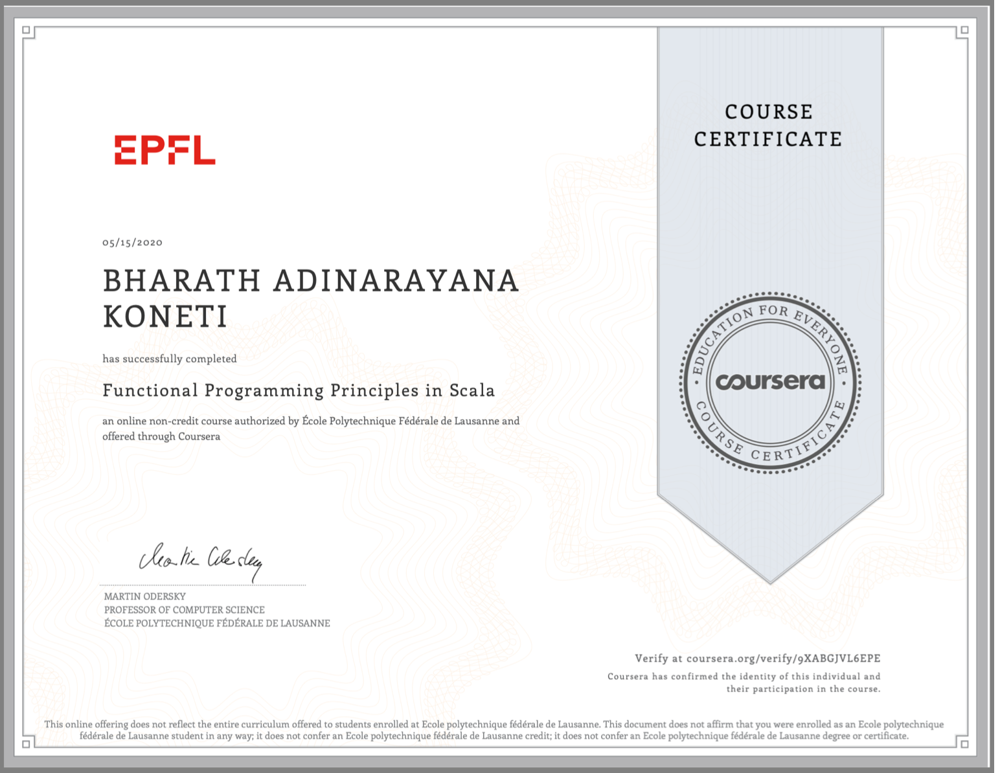

### Types of Programming

```
Functional Programming
Object oriented programming
Logic programming
```

### Imperative Programming(Jon von neumon style)

```

Limited by Jon von neumon data structure

Imperative programming breaks laws of mathemathics
 a) by including mutations


```

### Theory

```
Data types, operations and laws that describe these operations

ex: theory of polynomials: laws of calculating polynomial operation such as addition

```


### Lambda equations


```
- Lambda expression is an anonymous function
- which provides a very concise and functional syntax which is further used for writing anonymous methods. 
- The programming of a function is a body concept, and it's used for creating expression tree types or delegates.

```


## Reasons for functional programming

```
Simpler reasoning principles
better modularity
good for exploiting parallelism for multicore and cloud computing
```

#### Programming sense
```

Programming without mutable variables
Without assignments
Without loops
without imperative controls 

examples:
Pure List, XSLT, XPath, 
```

#### Wider/general sense

```
Programming with focus on functions in mathematics

examples:
Lips, scheme, racker, clojure,
SML, OCaml, F#
Haskell
scala,
smalltalk, ruby

```

#### Functions are first class citizens

```

Defined anywhere
sent as parameters to another function


```

### Scala and purpose of functional programming is important for parallelism and concurrency

```
PPP - Popular parallel programming

Parallel Programming: Execute program faster on parallel hardware

Concurrent programming: Manage concurrent execution


Non-determinism: caused by concurrent threads accessing shared mutable state
 - Eliminate the mutable state fundamentally

```

```

# People array in parallal usage (should be specified explicitly)
# Use people.par

val people: Array[person]
val (minors, adults) = people.par partition(_.age < 10)

```


### referential transparency

The expression referential transparency is used in various domains, such as mathematics, logic, linguistics, philosophy and programming. It has quite different meanings in each of these domain. Here, we will deal only with computer programs, although we will show analogy with maths (simple maths, don’t worry). Note, however, that computer scientists do not agree on the meaning of referential transparency in programming. What we will look at is referential transparency as it is used by functional programmers.

### Substitution model

This scheme of expression evaluation is called the substitution model

The substitution model is formalized in the Lambda calculus which gives foundation for functional programming.


### Call of value and call by name

```
Call by Value evaluates the expression only once
Call by name doesn't evaluate if the name is not used

If a call by value terminates, a call by name should terminate

In Scala we normally use call by value
However, an applies => key is going to use Call-by-name

def form is "call-by-name"
val x = 2
val y = square(x) is "call-by-value"


AND : if(x) y else FALSE
OR  : if(x) TRUE else y
```

### Syntactic sugar

```
In computer science, syntactic sugar is syntax within a programming language that is designed to make things easier to read or to express. It makes the language "sweeter" for human use: things can be expressed more clearly, more concisely, or in an alternative style that some may prefer.
```


## Scala REPL

in Sbt shell

```
console
```

In terminal

```terminal
scala
```


